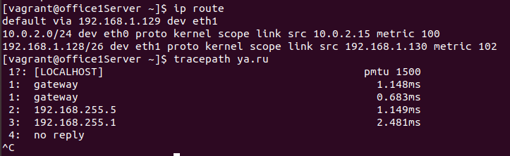
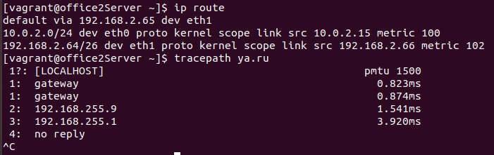

# Выполнение

# Теоретическая часть
* Найти свободные подсети
* Посчитать сколько узлов в каждой подсети, включая свободные
* Указать broadcast адрес для каждой подсети
* проверить нет ли ошибок при разбиении

## Схема сети
[схема сети в drawio](https://app.diagrams.net/#G1gYoQV-3EuAFWX8u0kSCpouW5Ecjqh2U1)

Про ошибки разбиения: как минимум, для избежания путаницы, переименовать сети так, чтобы office1 была 192.168.1.x, а office2 192.168.2.x

---
## сеть Central 192.168.0.0/24 (есть возможность создать подсети) 

### подсеть directors 192.168.0.0/28
- адрес сети: 192.168.000.0
- маска сети: 255.255.255.240
- начальный адрес: 192.168.000.1
- конечный адрес: 192.168.000.14
- броадкаст: 192.168.000.15
- всего адресов: 16
- доступных адресов:14
- занято: 1

### подсеть free_1 192.168.0.16/28 (возможно создать)
- адрес сети: 192.168.0.16
- маска сети:	255.255.255.240
- начальный адрес: 192.168.0.17
- конечный адрес: 192.168.0.30
- броадкаст: 192.168.0.31
- всего адресов: 16
- доступных адресов:14

### подсеть office hardware 192.168.0.32/28
- адрес сети: 192.168.0.32
- маска сети	255.255.255.240
- начальный адрес: 192.168.0.33
- конечный адрес: 192.168.0.46
- броадкаст: 192.168.0.47
- всего адресов: 16
- доступных адресов: 14

### подсеть free_2 192.168.0.48/28 (возможно создать)
- адрес сети: 192.168.0.48
- маска сети: 255.255.255.240
- начальный адрес: 192.168.0.49
- конечный адрес: 192.168.0.62
- броадкаст: 192.168.0.63
- всего адресов: 16
- доступных адресов: 14

### подсеть wifi 192.168.0.64/26
- адрес сети: 192.168.0.64
- маска сети	255.255.255.192
- начальный адрес: 192.168.0.65
- конечный адрес: 192.168.0.126
- броадкаст: 192.168.0.127
- всего адресов: 64
- доступных адресов: 162

### подсеть free_3 192.168.0.128/25 (возможно создать)
- адрес сети: 192.168.0.128
- маска сети	255.255.255.128
- начальный адрес: 192.168.0.129
- конечный адрес: 192.168.0.254
- броадкаст: 192.168.0.255
- всего адресов: 128
- доступных адресов: 126

---

## сеть office1 192.168.1.0/24 (все возможные подсети созданны)

### подсеть dev 192.168.1.0/25:
- адрес сети: 192.168.1.0
- маска сети:	255.255.255.126
- начальный адрес: 192.168.1.126
- конечный адрес: 192.168.1.127
- броадкаст:192.168.1.128
- всего адресов: 128
- доступных адресов: 126

### подсеть test servers 192.168.1.128/26
- адрес сети: 192.168.1.128
- маска сети:	255.255.255.192
- начальный адрес: 192.168.1.129
- конечный адрес: 192.168.1.190
- броадкаст: 192.168.1.191
- всего адресов: 64
- доступных адресов: 62
- занято: 1

### подсеть office hardware 192.168.1.192/26
- адрес сети: 192.168.1.192
- маска сети:	255.255.255.192
- начальный адрес: 192.168.1.193
- конечный адрес: 192.168.1.254
- броадкаст: 192.168.1.255
- всего адресов: 64
- доступных адресов: 62

---

## сеть office2 192.168.2.0/24 (все возможные подсети созданны)

### подсеть dev 192.168.2.0/26
- адрес сети: 192.168.2.0
- маска сети:	255.255.255.192
- начальный адрес: 192.168.2.1
- конечный адрес: 192.168.2.62
- броадкаст: 192.168.2.63
- всего адресов: 64
- доступных адресов: 62

### подсеть test servers 192.168.2.64/26
- адрес сети: 192.168.2.64
- маска сети:	255.255.255.192
- начальный адрес: 192.168.2.65
- конечный адрес: 192.168.2.126
- броадкаст: 192.168.2.127
- всего адресов: 64
- доступных адресов: 62
- занято:1

### подсеть managers 192.168.2.128/26
- адрес сети: 192.168.2.128
- маска сети:	255.255.255.192
- начальный адрес: 192.168.2.129
- конечный адрес: 192.168.2.190
- броадкаст: 192.168.2.191
- всего адресов: 64
- доступных адресов: 62

### подсеть office hardware 192.168.2.192/26
- адрес сети: 192.168.2.192
- маска сети:	255.255.255.192
- начальный адрес: 192.168.2.193
- конечный адрес: 192.168.2.254
- броадкаст: 192.168.2.255
- всего адресов: 64
- доступных адресов: 62

---

# Практическая часть

* Соединить офисы в сеть согласно схеме и настроить роутинг
* Все сервера и роутеры должны ходить в инет черз inetRouter
* Все сервера должны видеть друг друга
* у всех новых серверов отключить дефолт на нат (eth0), который вагрант поднимает для связи
* при нехватке сетевых интервейсов добавить по несколько адресов на интерфейс

## После запуска Vagrant'а

### Отключение интерфеса eth0:
Везде, кроме inetRouter, но тогда не получится подключится по ssh
```
ip link set eth0 down
```
---

### Настройка маршрутизации
На серверах надо удалить все маршруты и прописать один дефолтный.
```
ip route add default via xxx.xxx.xxx.xxx dev eth1
```

* для centralRouter 192.168.255.1
* для centralServer 192.168.0.1
* для office1Router 192.168.255.5
* для office1Server 192.168.1.129
* для office2Router 192.168.255.9
* для office2Server 192.168.2.65

Прописал дефолтный маршрут в Vagrant файл

Проверка маршрутов (в интернет дожен ходить через inetRouter, а не через NAT)





---
### настройка DNS:
Пропишем DNS. они находятся в файле ```resolv.conf```

```
vi /etc/resolv.conf
```

надо написать строчку

```nameserver 8.8.8.8```

и перезапустить сеть
```
/etc/init.d/network restart
или
service network restart
```
так перезапустить не получилось, пришлось перезагрузить ```shutdown -r```

Это надо сделать везде, кроме inetRouter. Теоритически, можно не прописывать на машинах-маршрутизаторах, но тогда даже обновить их не получиться.

В итоге после второй перезагрузки настройки DNS теряются, сделал настройку DNS в Vagrant файле

# задание 4 (с GitLab'а)
- поднять nginx на officе2Server

Надо создать файл ```/etc/yum.repos.d/nginx.repo``` и прописать в него:
```
[nginx]
name=nginx repo
baseurl=http://nginx.org/packages/centos/$releasever/$basearch/
gpgcheck=0
enabled=1
```
Установка Nginx: ```yum install nginx```

По умолчанию, в CentOS работает брандмауэр, поэтому необходимо добавить рабочие порты 80 (http) и 443 (https) в правила на исключение (точнее должен работать, но в версии CentOS, поднимаемой вагрантом не работатет):

```
firewall-cmd --permanent --add-port=80/tcp
firewall-cmd --permanent --add-port=443/tcp
```
Перезапуск firewalld: ```firewall-cmd --reload```

Добавление NGINX в автозапуск при загрузке CentOS: ```systemctl enable nginx```

Запуск веб-сервера: ```systemctl start nginx```

---
В процессе
- Пробросить порт с локалхоста на inetRouter
- настроить проброс порта до office2Server
- запретить office1Server ходить на office2Server на 80й порт, все остальные должны работать
- запретить office1Server отвечать на пинг, всем кроме inetRouter, но office1Server должен пинговать всех остальных
